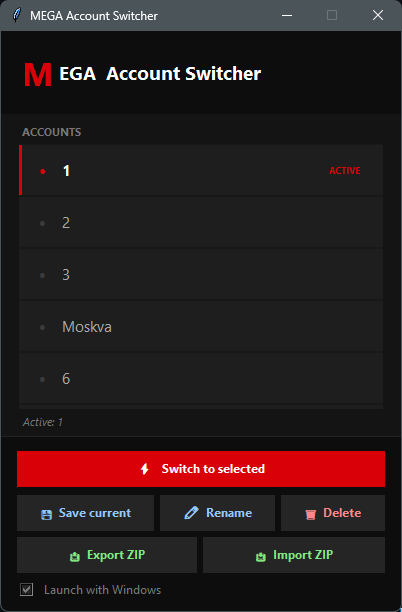

# MEGA Account Switcher

> Быстрое переключение между несколькими аккаунтами MEGAsync на Windows — без ручного входа/выхода.


---

## Возможности

- **Переключение в 1 клик** — выбери аккаунт, программа перезапустит MEGAsync с нужной сессией
- **Системный трей** — работает в фоне, список аккаунтов по правому клику
- **Сворачивание в трей** — закрытие/сворачивание окна → уходит в трей, не в taskbar
- **Автозапуск** — опция «Start with Windows» прямо в приложении
- **Экспорт / Импорт профилей** — перенос аккаунтов между ПК через ZIP-архив
- **Сохранение профилей** — каждый аккаунт хранится отдельно, независимо

---
## Скриншот

---

## Быстрый старт

### Вариант А — готовый exe (Windows)

1. Скачай `MEGA-Switcher.exe`
2. Запусти — программа найдёт MEGAsync автоматически
3. Нажми **«💾 Save current»** чтобы сохранить текущий аккаунт
4. Повтори для каждого аккаунта (входи вручную через MEGAsync, сохраняй профиль)
5. Переключайся через список или иконку в трее

### Вариант Б — запуск из исходников

```bash
# Зависимости
pip install pystray pillow

# Запуск
python mega_switcher.py
```

### Сборка exe самостоятельно

```bash
pip install pyinstaller pystray pillow

pyinstaller --onefile --windowed --name "MEGA-Switcher" ^
  --icon app.ico ^
  --collect-all pystray ^
  --collect-all PIL ^
  --hidden-import pystray._win32 ^
  --hidden-import winreg ^
  mega_switcher.py
```

Готовый файл появится в папке `dist/`.

---

## Как это работает

MEGAsync хранит сессию в двух местах:

| Файл | Описание |
|------|----------|
| `MEGAsync.cfg` | Зашифрованный токен сессии |
| `megaclient_statecache15_<HASH>.db` | Дерево файлов и состояние синхронизации |
| `file-service/<HASH>/` | Кэш файлов для текущей сессии |

При переключении программа:
1. Останавливает MEGAsync (`taskkill`)
2. Восстанавливает файлы нужного профиля
3. Запускает MEGAsync обратно

---

## ⚠️ Важно: безопасность хешей и сессий

> **Прочти это перед тем как делиться файлами или заливать на GitHub**

### Что такое хеш аккаунта

Каждый аккаунт MEGA имеет уникальный хеш в имени файла базы данных:
```
megaclient_statecache15_dFc0bGludHM1WVUKlazt1fsdfsfsdcxcvdsfKbE.db
                        ^^^^^^^^^^^^^^^^^^^^^^^^^^^^^^^^^^^^^^
                        Это и есть хеш — уникален для каждой сессии
```

Этот хеш **не является паролем**, но вместе с `MEGAsync.cfg` он позволяет восстановить активную сессию.

### Что НЕЛЬЗЯ публиковать

| Файл / Папка | Риск |
|---|---|
| `MEGAsync.cfg` | Содержит зашифрованный токен сессии — **ключ от аккаунта** |
| `megaclient_statecache15_*.db` | Содержит хеш и состояние — частичный доступ к аккаунту |
| `profiles/` (папка целиком) | Все сохранённые профили со всеми аккаунтами |
| `mega_switcher_paths.json` | Пути к папкам на твоём ПК (личная информация) |
| ZIP-архив от «Export» | Содержит все перечисленные данные в упакованном виде |

### Где хранятся данные

```
C:\Users\<ТВО_ИМЯ>\AppData\Local\Mega Limited\MEGAsync\
├── MEGAsync.cfg                          ← НЕ публиковать
├── megaclient_statecache15_<hash>.db     ← НЕ публиковать
├── file-service\<hash>\                  ← НЕ публиковать
└── profiles\                             ← НЕ публиковать
    ├── profiles.json
    ├── Work\
    │   ├── MEGAsync.cfg
    │   └── megaclient_statecache15_*.db
    └── Personal\
        └── ...
```

Всё это **не попадает в репозиторий** благодаря `.gitignore`.

### Безопасное использование Export/Import

- ZIP-архив от **Export** — это резервная копия **всех твоих сессий**
- Храни его как пароль: не в облаке без шифрования, не в мессенджерах
- Если файл попал к чужому — смени пароли MEGA на всех аккаунтах и завершi сессии в настройках MEGA

### Если сессия скомпрометирована

1. Зайди на [mega.io](https://mega.io) → Настройки → Безопасность → **Завершить все сессии**
2. Смени пароль
3. Удали профиль в MEGA Switcher и сохрани заново

---

## Требования

- Windows 10 / 11
- [MEGAsync](https://mega.io/desktop) — установленный и настроенный
- Python 3.10+ (только для запуска из исходников)

---

## Зависимости (Python)

| Пакет | Зачем |
|-------|-------|
| `tkinter` | GUI (входит в стандартный Python) |
| `pystray` | Иконка в системном трее |
| `Pillow` | Рисование иконки |
| `winreg` | Автозапуск (входит в стандартный Python) |

---

## Структура проекта

```
MEGA-Switcher/
├── mega_switcher.py      # Исходный код v1.0.0 (~950 строк)
├── video.mp4             # Видеопрезентация работы программы
├── app.ico               # Иконка приложения
├── MEGA-Switcher.exe     # Готовый исполняемый файл
├── .gitignore            # Исключает личные данные из git
└── README.md             # Этот файл
```

---

## Демонстрация

[](https://www.youtube.com/watch?v=WWlP_lZeeUE)

> Видеопрезентация: переключение между аккаунтами, трей-меню, экспорт/импорт профилей.

---

## Автор

**[@mrder112](https://github.com/mrder112)**

| Роль | |
|---|---|
| Идея и постановка задачи | @mrder112 |
| Тестирование и требования | @mrder112 |
| Разработка кода | [Claude](https://claude.ai) (Anthropic) — весь код написан AI-ассистентом по описанию требований |

> Проект создан в рамках эксперимента по AI-assisted разработке: от идеи до готового exe через диалог с Claude.

---

## Лицензия

MIT — используй свободно, но **не несу ответственности за потерю доступа к аккаунтам MEGA**.

---

## Отказ от ответственности

Программа не аффилирована с MEGA Limited. Используется публичное поведение MEGAsync (файлы конфигурации на диске). При обновлении MEGAsync структура файлов может измениться.
